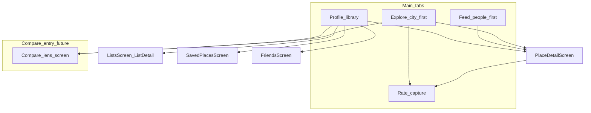

> **Mirror of Cursor plan `localsonly_state_and_ux_a8bc3736` — do not edit here; update the Cursor plan and re-mirror.**
>
> Source of truth: `/Users/rob/.cursor/plans/localsonly_state_and_ux_a8bc3736.plan.md`.
> Mirror policy: see [`docs/plans/README.md`](plans/README.md) (D1).

---

# LocalsOnly master plan — product, UX, and execution bible

This document is the **canonical reference** for where the app stands, what “good” looks like, and how work should be sequenced. **Smaller plans** (per phase or per feature slice) should:

1. Link back to **section IDs** (anchors below) they implement.
2. List **files touched** using repo paths from [§4 Inventory](#4-repository-inventory).
3. Copy **acceptance criteria** verbatim or extend them with measurable additions.
4. Record **decisions** that contradict this doc in [§11 Decision log](#11-decision-log-template) (or ADRs in-repo).

**Suggested repo mirror (optional):** copy or symlink into [`docs/`](docs/) as version-controlled truth (e.g. `docs/master-plan-localsonly-ux.md`) so PRs can reference it. This Cursor plan file remains the working master unless you migrate.

---

## 1. Vision and constraints {#vision}

### 1.1 North-star experience (user-facing)

The app should feel like an **experience** that rewards logging favorites, **comparing** how spots stack up across areas or friends, and **sharing** credibly — not a utility form.

**Reference aesthetics (non-literal):**

- **Hinge-like:** calm pacing, one primary intent per screen beat, prompts and personality in copy, progressive disclosure.
- **Airbnb-like:** generous spacing between sections, strong imagery tiles, consistent corner radii and card rhythm, filter/search that doesn’t fight the hero content.

### 1.2 Product constraints (must not violate)

Source: [`docs/prd.md`](prd.md).

- San Diego–first positioning; eligibility tiers gate contribution (`browse_only`, `provisional_local`, `verified_local`, etc.).
- **No ML / heavy ranking engine in v1** — any “personalization” must be **honest** (heuristic, labeled, or clearly aggregate).
- v1 feed scope: friend activity, place aggregates, simple city popular/trending — **not** advanced recommendation.

### 1.3 Policy and ops context (UX must respect)

| Document | Purpose |
|----------|---------|
| [`docs/local-contributor-eligibility.md`](local-contributor-eligibility.md) | Eligibility framing — UI must not promise verified locality beyond system state. |
| [`docs/moderation-operations.md`](moderation-operations.md) | Moderation — Admin surfaces exist (`ios/LocalsOnlyApp/Screens/AdminScreen.swift`); user-facing messaging on restriction. |
| [`docs/location-privacy-retention.md`](location-privacy-retention.md) | Privacy — copy and settings must align. |
| [`docs/mvp-smoke-test.md`](mvp-smoke-test.md) | Release QA checklist — extend when adding flows. |

---

## 2. Current-state summary {#current-state}

### 2.1 Stack

| Layer | Technology | Root |
|-------|------------|------|
| iOS app | SwiftUI | `ios/LocalsOnlyApp/` |
| API | Vapor 4, Fluent, PostgreSQL | `backend/Sources/App/` |
| DB migrations | Plain SQL, numbered | `backend/migrations/` (`0001`–`0015`) |
| Tooling | Makefile | `Makefile` (`make up`, `make run`, `make test`, `make ios`) |

### 2.2 Shell navigation

`ios/LocalsOnlyApp/Screens/RootView.swift`:

- **Signed out:** `AuthScreen` (multi-step: welcome → phone → OTP → display name → invite code).
- **Signed in:** `TabView` — **Feed**, **Explore**, **Rate**, **Profile** (`SessionManager.AppTab`).
- **Onboarding:** `fullScreenCover` when `hasSeenOnboarding` is false (`ios/LocalsOnlyApp/Screens/OnboardingScreen.swift`).
- **Unsaved rating:** switching away from Rate with draft triggers discard alert (`hasUnsavedRating`).

### 2.3 Known product/UX defects (why it feels “weak”)

| ID | Issue | Evidence |
|----|--------|----------|
| **UX-01** | **Duplicate discovery:** “Popular” feed vs Explore “Trending” both answer city-wide popularity with similar cards. | `ios/LocalsOnlyApp/Screens/FeedScreen.swift`, `ios/LocalsOnlyApp/Screens/ExploreScreen.swift` |
| **UX-02** | **False personalization:** “For You” uses `popular.prefix(8)` + friend banner, not a distinct model. | `ios/LocalsOnlyApp/Screens/FeedScreen.swift` (~220–262), `ios/LocalsOnlyApp/ViewModels/FeedViewModel.swift` |
| **UX-03** | **Tab semantics blur:** Feed reads as second Explore plus Friends segment. | Same files + `ios/LocalsOnlyApp/ViewModels/SessionManager.swift` |
| **UX-04** | **Compare story absent:** no dedicated surface for “across town” despite neighborhoods, item search, lists. | Explore has pieces; no orchestrated compare UX |
| **UX-05** | **Share is peripheral:** `ShareLink` mainly on Profile rating cards; not woven into discovery moments. | `ios/LocalsOnlyApp/Screens/ProfileScreen.swift` |
| **UX-06** | **Premium rhythm:** repeated 2-col grids + segmented pickers; section hierarchy and whitespace not yet systematic. | `ios/LocalsOnlyApp/DesignSystem/Spacing.swift`, multiple screens |

---

## 3. Target information architecture {#target-ia}

### 3.1 Tab jobs (canonical — child plans must align)

These **jobs** are the contract; marketing labels may differ.

| Tab | Primary job | Secondary | Must NOT duplicate |
|-----|-------------|-----------|---------------------|
| **Feed** | **People & activity:** what friends (and optionally follow-graph later) are doing — chronological or story-like recap. | Lightweight prompts (“rate your week”), notifications deep links. | City-wide popularity grids that mirror Explore’s main job. |
| **Explore** | **City & place discovery:** search, map, neighborhoods, trending aggregates — the **San Diego lens**. | Save/bookmark entry points, “add place”. | Friend activity list (that belongs on Feed). |
| **Rate** | **Capture:** fastest trustworthy path to log a fav with context (photo, tags, privacy). | Continuity from Explore selection (`selectedPlace`, tab switch). | Long discovery browsing (defer to Explore). |
| **Profile** | **Library & identity:** my ratings, rankings, taste, lists, saved, invites; edit profile. | Deep links to friends, user profiles. | Full-screen duplicate of Explore trending. |

### 3.2 Resolution of UX-01 / UX-02 (required direction)

**Decision bucket (pick one in Phase 1 child plan — record in §11):**

- **Option A — Explore owns city pulse:** Remove or drastically shrink **Popular** on Feed; Feed default segment = **Friends** (or a new “Latest”). Optionally keep one slim “City snapshot” module linking into Explore.
- **Option B — Feed owns pulse:** Move Explore’s trending module behind search/neighborhood first screen (less duplication); Feed keeps curated rails — **still** requires different layout/copy than Explore so users perceive one city story, not two.

**For You / personalization (UX-02):**

- **Rename** to honest label (“Starting points”, “San Diego picks”) **or**
- **Remove segment** until backend provides distinct data **or**
- **Implement** minimal heuristic API (e.g. blend popular + friend-linked neighborhoods) — only if labeled and PRD-aligned.

### 3.3 Navigation map (target)



---

## 4. Repository inventory {#inventory}

### 4.1 iOS Swift files (complete)

**App entry**

| File | Role |
|------|------|
| `ios/LocalsOnlyApp/LocalsOnlyApp.swift` | `@main` |
| `ios/LocalsOnlyApp/ContentView.swift` | Root composition |

**Screens**

| File | Role |
|------|------|
| `ios/LocalsOnlyApp/Screens/RootView.swift` | Tabs, onboarding, toast, unsaved rating |
| `ios/LocalsOnlyApp/Screens/AuthScreen.swift` | Phone auth steps |
| `ios/LocalsOnlyApp/Screens/OnboardingScreen.swift` | First-run story |
| `ios/LocalsOnlyApp/Screens/FeedScreen.swift` | Popular / Friends / For You |
| `ios/LocalsOnlyApp/Screens/ExploreScreen.swift` | Search, trending, neighborhoods, map toggle, suggest place |
| `ios/LocalsOnlyApp/Screens/MapExploreView.swift` | Map exploration |
| `ios/LocalsOnlyApp/Screens/RateScreen.swift` | Rating composer |
| `ios/LocalsOnlyApp/Screens/PlaceDetailScreen.swift` | Place hero, ratings, cosigns, lists |
| `ios/LocalsOnlyApp/Screens/ProfileScreen.swift` | Profile hub + ratings + sheets |
| `ios/LocalsOnlyApp/Screens/UserProfileScreen.swift` | Other user |
| `ios/LocalsOnlyApp/Screens/FriendsScreen.swift` | Friend graph |
| `ios/LocalsOnlyApp/Screens/NotificationsScreen.swift` | In-app notifications |
| `ios/LocalsOnlyApp/Screens/SavedPlacesScreen.swift` | Bookmarks |
| `ios/LocalsOnlyApp/Screens/ListsScreen.swift` | Lists + embedded `ListDetailScreen` |
| `ios/LocalsOnlyApp/Screens/InviteScreen.swift` | Invites |
| `ios/LocalsOnlyApp/Screens/AdminScreen.swift` | Admin (hidden gesture from Profile) |

**ViewModels**

| File | Role |
|------|------|
| `ios/LocalsOnlyApp/ViewModels/SessionManager.swift` | Session, tab selection, bookmarks, eligibility, API facade usage |
| `ios/LocalsOnlyApp/ViewModels/FeedViewModel.swift` | `popularFeed`, `friendsFeed` |
| `ios/LocalsOnlyApp/ViewModels/ExploreViewModel.swift` | Search, trending, suggest |
| `ios/LocalsOnlyApp/ViewModels/RateViewModel.swift` | Submit rating |
| `ios/LocalsOnlyApp/ViewModels/ProfileViewModel.swift` | Profile, ratings, rankings |

**Networking**

| File | Role |
|------|------|
| `ios/LocalsOnlyApp/Networking/APIClient.swift` | All HTTP endpoints |
| `ios/LocalsOnlyApp/Networking/APIModels.swift` | Codables |
| `ios/LocalsOnlyApp/Networking/SessionStore.swift` | Token persistence |

**Components / design system**

| File | Role |
|------|------|
| `ios/LocalsOnlyApp/DesignSystem/Spacing.swift` | Spacing tokens |
| `ios/LocalsOnlyApp/DesignSystem/Typography.swift` | Text styles |
| `ios/LocalsOnlyApp/DesignSystem/ColorTokens.swift` | Semantic colors |
| `ios/LocalsOnlyApp/DesignSystem/Illustrations.swift` | Illustration helpers |
| `ios/LocalsOnlyApp/Components/ImageTileCard.swift` | Discovery tiles |
| `ios/LocalsOnlyApp/Components/GlassCard.swift` | Panel surfaces |
| `ios/LocalsOnlyApp/Components/FeedPhotoCard.swift` | Friend feed rows |
| `ios/LocalsOnlyApp/Components/RatingCard.swift` | Rating rows |
| `ios/LocalsOnlyApp/Components/CategoryFilterStrip.swift` | Category chips |
| `ios/LocalsOnlyApp/Components/PrimaryButton.swift`, `SecondaryButton.swift` | Buttons |
| `ios/LocalsOnlyApp/Components/ScoreSlider.swift` | Score input |
| `ios/LocalsOnlyApp/Components/EmptyStateView.swift` | Empty states |
| `ios/LocalsOnlyApp/Components/ToastView.swift` | Status toasts |
| `ios/LocalsOnlyApp/Components/BrandLockupView.swift` | Toolbar brand |
| `ios/LocalsOnlyApp/Components/EligibilityBanner.swift` | Eligibility messaging |
| `ios/LocalsOnlyApp/Components/StatePill.swift` | Status pills |
| `ios/LocalsOnlyApp/Components/LoadingShimmer.swift`, `WavesLoadingView.swift` | Loading |
| `ios/LocalsOnlyApp/Components/PlaceCard.swift` | Compact place rows |
| `ios/LocalsOnlyApp/Components/FullScreenPhotoViewer.swift` | Photo lightbox |

### 4.2 Backend modules

Registered in `backend/Sources/App/Shared/Module.swift`:

`Auth`, `Users`, `Places`, `Ratings`, `Friendships`, `Feed`, `Eligibility`, `Moderation`, `Uploads`, `Tags`, `Bookmarks`, `Lists`, `Cosigns`, `Notifications`, `Invites`.

### 4.3 Database migrations (schema evolution)

| Migration | Theme |
|-----------|--------|
| `0001_base_schema.sql` | Core schema |
| `0002_eligibility_and_moderation.sql` | Eligibility/moderation |
| `0003_user_sessions.sql` | Sessions |
| `0004_moderation_action_type_suppress_rating.sql` | Moderation enum |
| `0005_seed_test_invite.sql` | Seed invite |
| `0006_item_ratings.sql` | Item-level ratings |
| `0007_rating_photos.sql` | Photos |
| `0008_places_coordinates.sql` | Geo |
| `0009_seed_tags.sql` | Tags |
| `0010_place_cover_photo.sql` | Covers |
| `0011_backfill_cover_photos.sql` | Backfill |
| `0012_saved_places.sql` | Bookmarks |
| `0013_lists.sql` | Lists |
| `0014_cosigns.sql` | Cosigns |
| `0015_notifications.sql` | Notifications |

---

## 5. API capability vs client surfacing {#api-surface}

`ios/LocalsOnlyApp/Networking/APIClient.swift` already exposes many endpoints; **surfacing** is uneven.

**Generally fully surfaced:** auth, eligibility, places search/suggest, ratings CRUD, feed popular/friends, friendships, bookmarks toggle, lists, uploads, tags, notifications, invites, cosigns.

**Product gaps are mostly UX orchestration**, not raw absence of endpoints — compare flows may later need **aggregations** not worth adding until IA is fixed.

---

## 6. Phased roadmap {#phases}

Each phase should spawn a **child plan** named consistently: e.g. `phase-1-ia-feed-explore.md` with: goals, tasks, file list, mocks/wireframes links, acceptance tests, rollout notes.

### Phase 0 — Governance and baselines {#phase-0}

**Goal:** Make execution repeatable.

**Deliverables**

- Confirm this document’s location (Cursor plan vs [`docs/`](.) mirror).
- Template for child plans (copy §10).
- Branch/release convention optional.

**Acceptance criteria**

- Every future phase plan references section IDs from this doc.
- Smoke test doc updated if navigation changes ([`docs/mvp-smoke-test.md`](mvp-smoke-test.md)).

---

### Phase 1 — Information architecture: Feed vs Explore + honest personalization {#phase-1}

**Goal:** Eliminate UX-01, UX-02, UX-03 per [§3](#target-ia).

**Primary files**

- `ios/LocalsOnlyApp/Screens/FeedScreen.swift`, `ios/LocalsOnlyApp/ViewModels/FeedViewModel.swift`
- `ios/LocalsOnlyApp/Screens/ExploreScreen.swift`, `ios/LocalsOnlyApp/ViewModels/ExploreViewModel.swift`
- `ios/LocalsOnlyApp/Screens/RootView.swift` (tab labels/order only if needed)
- `ios/LocalsOnlyApp/ViewModels/SessionManager.swift` if tab enum / defaults change

**Acceptance criteria**

- [ ] User testing / heuristic: a first-time user can articulate **different reasons** to open Feed vs Explore in one sentence each.
- [ ] No screen shows two competing **city-wide popularity** modules with the same card pattern without intentional differentiation (copy + layout + single CTA).
- [ ] No segment labeled “For You” unless data is distinct OR label matches PRD-honest heuristic (document which in §11).
- [ ] Empty states for Feed Friends reflect invite/add-friend path (`ios/LocalsOnlyApp/Screens/FriendsScreen.swift`).

**Backend dependency:** None for minimal path; optional small feed endpoint if implementing real heuristic.

**Out of scope:** New recommendation ML.

---

### Phase 2 — Compare across town (v1) {#phase-2}

**Goal:** Address UX-04 with a **guided** compare experience using existing APIs first.

**Concept lenses (implement incrementally)**

1. **Item/category lens:** User picks item flavor (e.g. matcha) → ranked/browsable results with **neighborhood** chips — extends Explore item search UX.
2. **Neighborhood lens:** Pick two neighborhoods → show top places or top items per hood (may be client-side merge from search + filters in v1).
3. **Social lens (later):** “Overlap with friend” — may require new API if client cannot merge reliably.

**Primary files**

- New screen(s) under `ios/LocalsOnlyApp/Screens/` (e.g. `CompareScreen.swift` or modal flow from Explore).
- `ios/LocalsOnlyApp/Screens/ExploreScreen.swift` — entry point(s).
- `ios/LocalsOnlyApp/Networking/APIClient.swift` / backend only if Phase 5 triggers.

**Acceptance criteria**

- [ ] Compare flow reachable in **≤3 taps** from Explore (or Profile “your stats” — pick one primary entry in child plan).
- [ ] Copy explains **what is being compared** (item scores vs place aggregates vs your saves — avoid ambiguity).
- [ ] Fallback empty states when a hood has sparse data.

**Escalation to Phase 5:** If client-side stitching is too slow or inconsistent → define aggregate endpoint in child plan with query shapes.

---

### Phase 3 — Design system and premium rhythm {#phase-3}

**Goal:** Address UX-06 systematically (Airbnb spacing / tactile tiles / Hinge pacing).

**Workstreams**

1. **Layout templates:** Define 2–3 templates: **Hero + sections**, **Search-first**, **Feed story** — document max widths, section spacing (`Spacing.lg`/`xl` between intent regions), when **not** to use `Picker(.segmented)`.
2. **Tile spec:** `ImageTileCard` aspect ratio, title lines (2-line clamp), score badge position, press state (scale opacity).
3. **Motion:** Standardize spring params (reuse `RateScreen` success as reference) for navigation transitions and card tap.
4. **Profile narrative:** Reorder `ProfileScreen` so identity → taste → rankings → ratings feels like one story; reduce toolbar cognitive load.
5. **Typography:** Audit `Typography.swift` for section hierarchy (one H1-equivalent per screen).

**Acceptance criteria**

- [ ] Design checklist attached to child plan (spacing, type scale, card radii) with **before/after** screenshots for Feed, Explore, Profile.
- [ ] No arbitrary new spacing literals — use tokens or extend tokens with documented rationale.
- [ ] Voice pass on `EmptyStateView` call sites + onboarding.

---

### Phase 4 — Share, invites, and growth moments {#phase-4}

**Goal:** Address UX-05; align invites with emotional loop.

**Deliverables**

- Share from **Place detail**, **Explore** long-press or share affordance, **Rating success** optional share prompt (non-blocking).
- Richer share **text** (place name, score, neighborhood, “on LocalsOnly”) — URL strategy documented (universal links future vs plain text now).
- Audit `InviteScreen` copy vs Feed/Profile prompts.

**Acceptance criteria**

- [ ] At least **three** surfaces can invoke share (Profile rating remains one).
- [ ] Share payload reviewed for privacy (respect rating `privacy` field).

---

### Phase 5 — Backend escalation {#phase-5}

**Goal:** Add APIs **only** when Phase 2/4 cannot ship with client composition.

**Triggers (examples)**

- Friend overlap / compare requires server-side joins at scale.
- Personalized “For You” needs persisted taste vector — **explicitly** beyond PRD unless PRD updated.
- Share URLs need server-rendered OG metadata.

**Process**

- Child plan must cite **trigger**, propose **endpoint contract**, migration needs, and **backward compatibility** for `APIClient`.

---

## 7. Non-goals (explicit) {#non-goals}

- ML-based recommendation engine in v1 (per PRD).
- Multi-city expansion without product decision.
- Rewriting backend modular structure unless Phase 5 warrants new endpoints.

---

## 8. Quality bars and verification {#qa}

### 8.1 Manual

- Extend `docs/mvp-smoke-test.md` for any new primary navigation.
- Device matrix: at least one small phone + large Pro Max for `FeedScreen` density.

### 8.2 Automated

- Backend: `make test` must pass after API changes.
- iOS: run XCTest if/when tests exist; otherwise manual checklist until UI tests land.

---

## 9. Risks and mitigations {#risks}

| Risk | Mitigation |
|------|------------|
| IA change confuses existing users | Soft rollout: tooltips / first-session coach marks; changelog in onboarding snippet |
| Compare v1 feels thin | Lead with **item + neighborhood** story where data is richest |
| Over-building backend early | Phase gate: Phase 2 ships client-only compare or waits |
| Eligibility frustration | Keep `EligibilityBanner` + clear CTAs aligned with docs |

---

## 10. Child plan template {#child-template}

Use this skeleton for phase/feature plans:

```markdown
# Phase X — [Name]

## References
- Master: LocalsOnly master plan §[sections]

## Problem statement
## Scope (in / out)
## Design decisions
## Implementation tasks (checkboxes)
## Files touched (complete list)
## API changes (if any)
## Acceptance criteria (copy from master + additions)
## Verification steps
## Rollback / feature flags
```

The repo also ships a fuller, ready-to-copy version at [`docs/plans/CHILD_PLAN_TEMPLATE.md`](plans/CHILD_PLAN_TEMPLATE.md) — prefer that file when starting a new child plan.

---

## 11. Decision log template {#decisions}

| Date | Decision | Alternatives rejected | Section |
|------|----------|----------------------|---------|
| | e.g. Explore owns city pulse | Feed Popular retained | §3.2 |

A live, checked-in log lives at [`docs/plans/DECISION_LOG.md`](plans/DECISION_LOG.md).

---

## 12. Summary {#summary}

LocalsOnly is **functionally rich** (backend modules, iOS flows for ratings, social, lists, bookmarks, cosigns, notifications) but **emotionally thin** because **discovery is duplicated** ([§2.3 UX-01–02](#current-state)), **tabs lack distinct jobs** ([§3](#target-ia)), and **compare/share** are not orchestrated as primary experiences. This master plan fixes that through **phased IA correction**, a **guided compare v1**, **systematic design polish**, and **share loop expansion**, with **backend work only on escalation** ([§6 Phase 5](#phase-5)).
